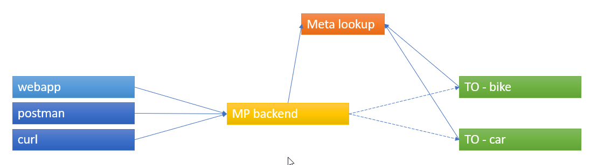

# Reference implementation TOMP API

## Overview  
This server was generated by the [swagger-codegen](https://github.com/swagger-api/swagger-codegen) project.  
By using the [OpenAPI-Spec](https://github.com/swagger-api/swagger-core), you can easily generate a server stub.  
This is an example of building a swagger-enabled server in Java using the SpringBoot framework.  

The underlying library integrating swagger to SpringBoot is [springfox](https://github.com/springfox/springfox)  

The spring application can be started as MP or as TO, dependend on the supplied profile. 

## MaaS Provider
The MaaS Provider can start this application using this profile: -Dspring.profiles.active=maasprovider 
This means you can start the MaaS Provider like this: _java -jar reference-[version]-exec.jar -Dspring.profiles.active=maasprovider_ 

The MaaS component will start at port 8090. This means you can call the API using http://localhost:8090/{localPath}

The MaaS Provider implements also the TOMP API. This means we (mis)used the API also for communicating between an app and the backend of the MaaS Provider. 

Before calling the MaaS component, you'll have to start the TO components (have a look at the application.yml). Default it's car and bike.

e.g. calling POST http://localhost:8090/planning-options/ with body 
<pre>{
  "start-time": 1546336800,
  "end-time": 1546337000,
  "from": {
    "lng": 6.169639,
    "lat": 52.253279
  },
  "radius": 10,
  "to": {
    "lng": 4.897934,
    "lat": 52.362941
  },
  "travellers": 1,
  "provide-ids": true,
  "users": [
    {
      "age": 20
    }
  ]
}</pre>
will result in a few planning options. There is a very simple implementation, dividing the route in a few legs and for each leg it will look for TOs that can fulfill the request. 

## Meta lookup
There is a seperate project with a meta lookup webservice. It contains the available TOs and MPs. The TOs and MPs that are currently implemented registrate themselves on the meta lookup.

## Operators
These operators are available: 
java -jar reference-[version]-exec.jar -Dspring.profiles.active=bike 
java -jar reference-[version]-exec.jar -Dspring.profiles.active=car 

There are also other possibilities to start up other operators, look at the application.yml. 

If you want to add extra functionality to a (new) operator, please make another provider class for that TO in each module.

## Front end
The front end contains a map and 2 seperate boxes on the right side. One is containing the request body (and a submit button), the most right one contains the response.

You should use the front end this way (example for https://tomp.dat.nl/bike as TO):
- first of all, replace the id in the header with a MP id (can be found on https://tomp.dat.nl/
- select POST /planning-options/ and click on 2 locations on the map; the request body will be filled in correctly
- optionally change the body before sending it. The response will be in the right box.
- change the provideIds: false to true, click on send. You've pre-reserved assets
- copy the ID that is provided into the 'id' box
- select POST /bookings and submit the request. A pending booking is returned.
- select POST /bookings/{id}/events and put in the 'COMMIT' command. Submit to commit the booking.

## Example calls
The {id} is produced by the example planning call. All the components don't persist data, so restarting them requires new calls.

### MaaS
_POST_ http://localhost:8090/bookings/
<pre>{
  "id": "{id}",
  "customer": {
    "id": "A0-123456",
    "first-name": "John",
    "last-name": "Doe",
    "phone": "string"
  }
}</pre>

_GET_ http://localhost:8090/operator/information

_POST_ http://localhost:8090/legs/{id}/events
<pre>{
  "time": 1546336800,
  "event": "SET\_IN\_USE",
  "comment": "string",
  "asset": {
    "asset-id": "bike1",
    "place": {
      "coordinate": {
        "lng": 6.169639,
        "lat": 52.253279
      }
    }
  }
}</pre>

# Demo
To facilitate the adoption, we've added a demo: 

- Build the jar file in /target
- Now you can call demo.bat (Windows, 64bit machine) that will set up a MaaS provider, a bike TO and a car TO.  
- When running the script 'plan-and-book.bat' in the scripts directory (open first a cmd box), you'll see the interaction between the three boxes. The planning is fired from the cmd box to the MP box, it will interact with the TO boxes and will send the result to the cmd box. 
- After that, you can select a trip to book.   The booking will be done in 2 steps: adding bookings to the TO and after that a commit.

#  Living environment
We've facilitated in a 'living environment', where you dan have a look how the TOMP API works. There are a few sample TOs available (car, bike, shared-car) and a very simple version of a MP. You can have a look at https://tomp.dat.nl/. 
Available URLS: https://tomp.dat.nl/bike, https://tomp.dat.nl/car and https://tomp.dat.nl/shared-car. At this moment it's for demo purposes only. When using the shared-car TO, please put in the email adres of the user your email address and you'll get the email for committing or denying the shared car.
